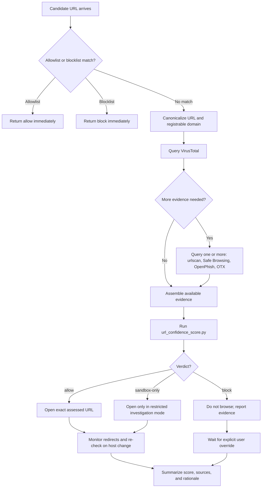

# Safe Web Confidence Protocol

Safe Web Confidence Protocol is a reusable agent skill for checking URL reputation before a browser opens a site. It combines local allow and block policy with external reputation sources such as VirusTotal, urlscan, Google Safe Browsing, OpenPhish, and AlienVault OTX.

Created by Alexander Calzada.

## Why this exists

Most agents browse too optimistically. This protocol forces a URL through a local policy check and a reputation phase before the browser touches the page. The result is cheaper than full-time scanning, safer than naive browsing, and simple enough to embed into another agent workflow.

## What it does

- short-circuits trusted or denied hosts through local policy files
- queries external reputation sources only when needed
- computes a normalized score and verdict: `allow`, `sandbox-only`, or `block`
- provides a Mermaid protocol diagram and a documented scoring model

## Protocol Flow



This is the actual browse gate. The browser should not touch an unfamiliar site until the URL has moved through this pipeline.

## Safety Scans Used

- `allowlist.txt`: short-circuits known-good hosts and subdomains without spending API calls
- `blocklist.txt`: hard-denies known-bad hosts and subdomains before any browsing can happen
- `VirusTotal`: primary aggregation layer for malware, phishing, suspicious, and benign vendor results
- `urlscan.io`: captures render context, redirect behavior, final host changes, and suspicious page history
- `Google Safe Browsing`: strong malware and social-engineering signal with high weight in the final verdict
- `OpenPhish`: phishing-focused intelligence source for fast confirmation on known lure infrastructure
- `AlienVault OTX`: pulse-based threat-intel context when a URL or domain has prior sightings

## Decision Logic

- local allow and deny rules are checked first to save compute and enforce personal policy
- VirusTotal is the first external scan because it provides the broadest vendor coverage
- additional scans are layered in when the host is unknown, login-themed, suspicious, or already flagged
- the scorer converts all signals into an explainable `allow`, `sandbox-only`, or `block` verdict
- any redirect or host change should be treated as a new target and re-scanned

## Repo layout

- `skills/safe-web-confidence-protocol/SKILL.md`
- `skills/safe-web-confidence-protocol/scripts/url_confidence_score.py`
- `skills/safe-web-confidence-protocol/references/scoring-model.md`
- `skills/safe-web-confidence-protocol/references/protocol-diagram.md`
- `skills/safe-web-confidence-protocol/references/allowlist.txt`
- `skills/safe-web-confidence-protocol/references/blocklist.txt`
- `tests/fixtures/`

## Threat model

This protocol is strongest against:

- known phishing and malware landing pages
- suspicious login flows on unfamiliar domains
- domains with existing threat-intelligence coverage
- repeated investigations where local policy can short-circuit the obvious cases

This protocol is weaker against:

- brand-new infrastructure with no reputation history
- benign domains hosting malicious user content briefly
- payloads that only turn malicious after browser interaction
- highly targeted pages visible only to a narrow victim set

The intended use is not "guarantee safety." The intended use is "raise the cost of bad browsing decisions and make agent browsing behavior auditable."

## Install

Place `skills/safe-web-confidence-protocol` into your agent's skill directory, or keep the repo cloned and reference the skill path directly.

## Configure

Populate the policy files with your own domains:

- `skills/safe-web-confidence-protocol/references/allowlist.txt`
- `skills/safe-web-confidence-protocol/references/blocklist.txt`

Add API keys through environment variables or an `.env` file loaded by your runtime:

- copy [.env.example](/Users/alexcalzada/Documents/secagentprotocol/.env.example) to `.env`
- fill in only the providers you plan to use

Optional API keys for live lookups:

- `VT_API_KEY`
- `URLSCAN_API_KEY`
- `GOOGLE_SAFE_BROWSING_API_KEY`
- `OPENPHISH_API_KEY`
- `OTX_API_KEY`

## Usage

```bash
python3 skills/safe-web-confidence-protocol/scripts/url_confidence_score.py \
  --url "https://candidate.example/login" \
  --allowlist-file skills/safe-web-confidence-protocol/references/allowlist.txt \
  --blocklist-file skills/safe-web-confidence-protocol/references/blocklist.txt \
  --fetch
```

## Sample outputs

Allowlist hit:

```json
{
  "url": "https://portal.trusted.example/home",
  "score": 100,
  "verdict": "allow",
  "reasons": [
    "Host matched allowlist rule: trusted.example."
  ]
}
```

High-risk URL:

```json
{
  "url": "https://xn--paypa1-l2c.example/login",
  "score": 0,
  "verdict": "block",
  "reasons": [
    "VirusTotal malicious ratio is high (8/23).",
    "Google Safe Browsing returned at least one threat match.",
    "Host structure looks suspicious (punycode or IP-style host).",
    "Login or verification path increases phishing risk."
  ]
}
```

## Validation

The repo includes lightweight fixtures so someone can sanity-check the scoring logic without API keys.

Benign-style sample:

```bash
python3 skills/safe-web-confidence-protocol/scripts/url_confidence_score.py \
  --url "https://example.com/" \
  --vt-json tests/fixtures/vt-benign.json \
  --urlscan-json tests/fixtures/urlscan-benign.json \
  --allowlist-domain example.com
```

Malicious-style sample:

```bash
python3 skills/safe-web-confidence-protocol/scripts/url_confidence_score.py \
  --url "https://xn--paypa1-l2c.example/login" \
  --vt-json tests/fixtures/vt-malicious.json \
  --gsb-json tests/fixtures/gsb-phishing.json
```

## Design notes

- local policy is deliberately simple: exact host or suffix match
- missing reputation data does not imply safety
- strong negative signals override optimistic numeric scores
- the protocol is designed to be explainable from the output alone

## Related files

- [SKILL.md](/Users/alexcalzada/Documents/secagentprotocol/skills/safe-web-confidence-protocol/SKILL.md)
- [scoring-model.md](/Users/alexcalzada/Documents/secagentprotocol/skills/safe-web-confidence-protocol/references/scoring-model.md)
- [protocol-diagram.md](/Users/alexcalzada/Documents/secagentprotocol/skills/safe-web-confidence-protocol/references/protocol-diagram.md)
