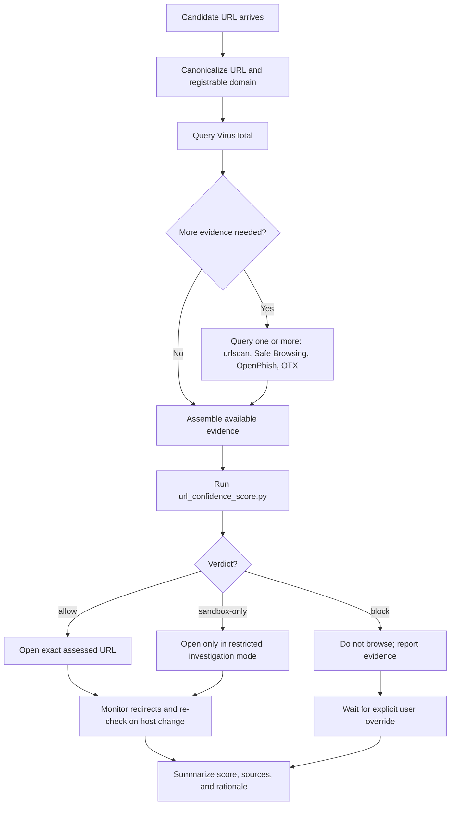

# Protocol Diagram

## Notes

- Query VirusTotal first because it is the primary aggregation source in this protocol.
- Use additional sources whenever the URL is unfamiliar, login-themed, recently seen, or already suspected of phishing or malware.
- Re-run the protocol if the page redirects to a different host or starts a download flow.
