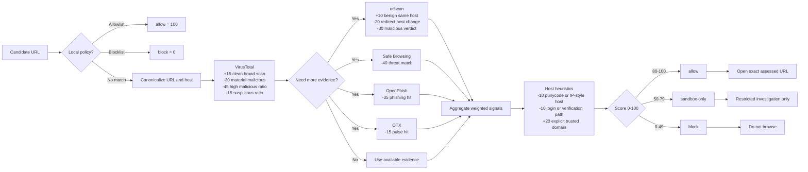

# Protocol Diagram

## Notes

- Query VirusTotal first because it is the primary aggregation source in this protocol.
- Add the secondary scans when the URL is unfamiliar, login-themed, recently seen, or already suspicious.
- Re-run the protocol if the page redirects to a different host or starts a download flow.
- Use the diagram weights as a quick visual summary; the full scoring rules live in `scoring-model.md`.
